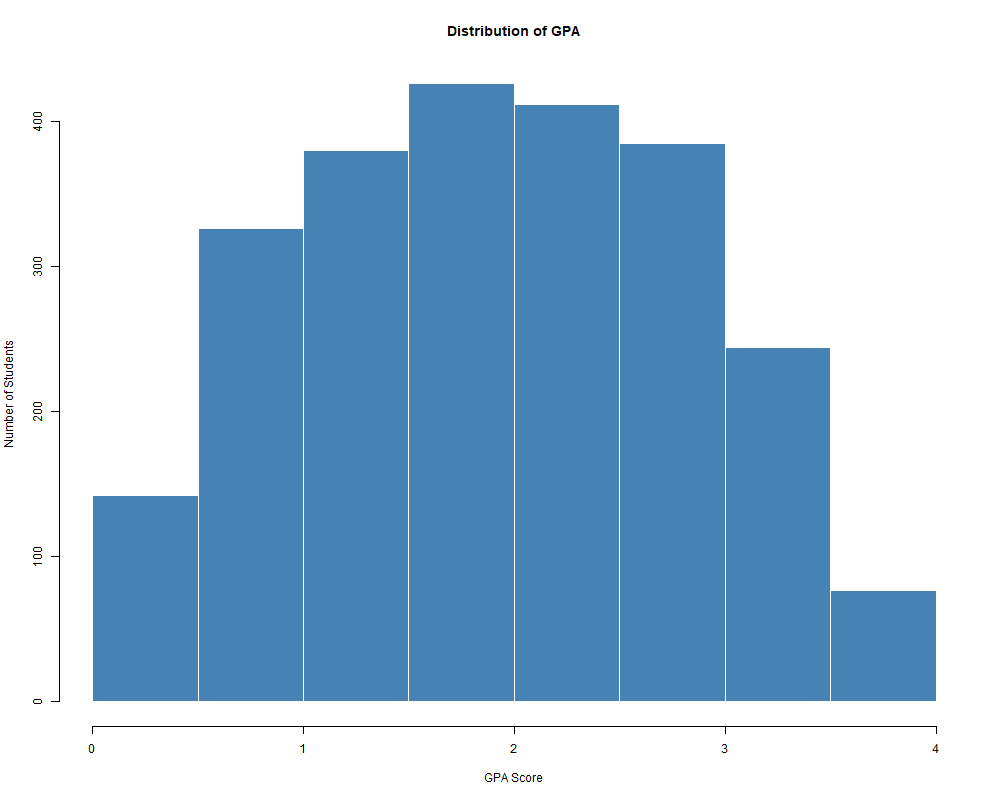
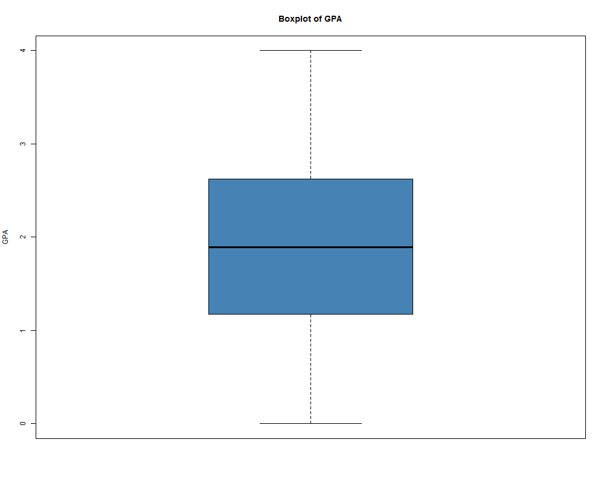
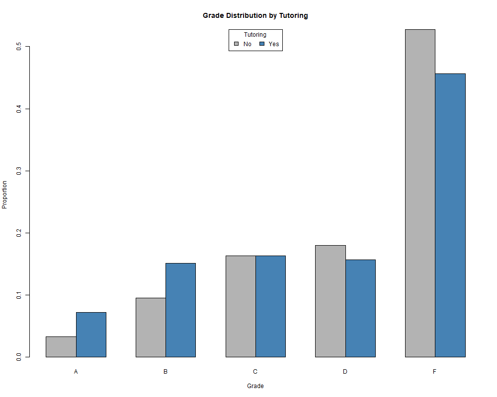
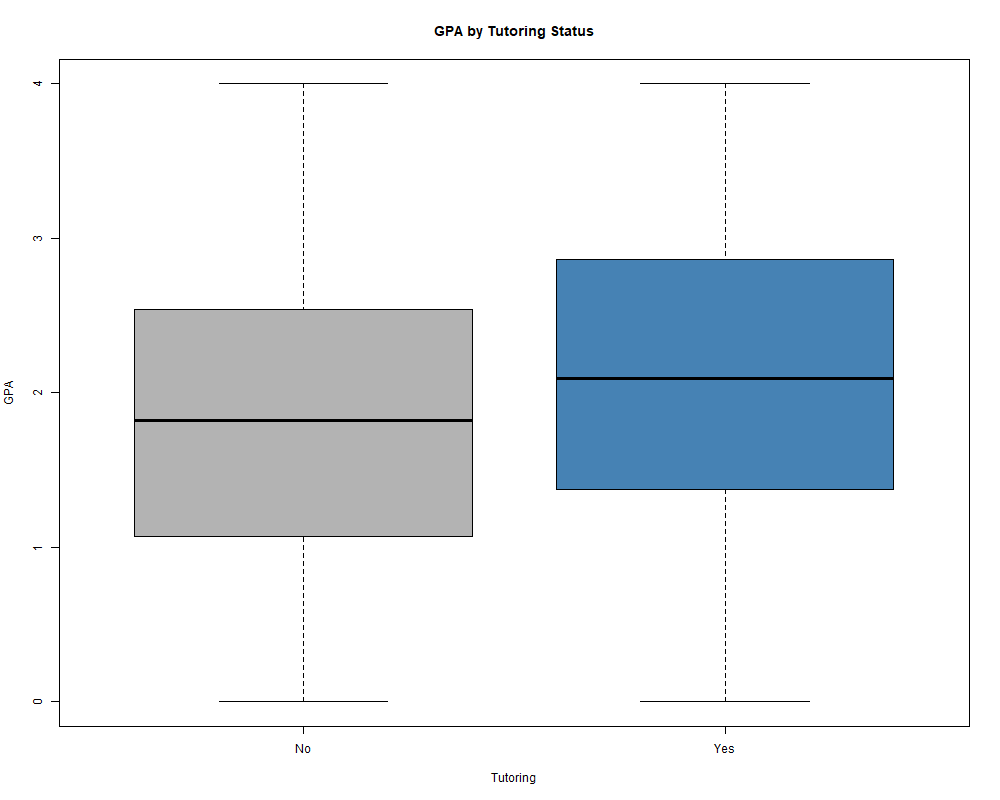
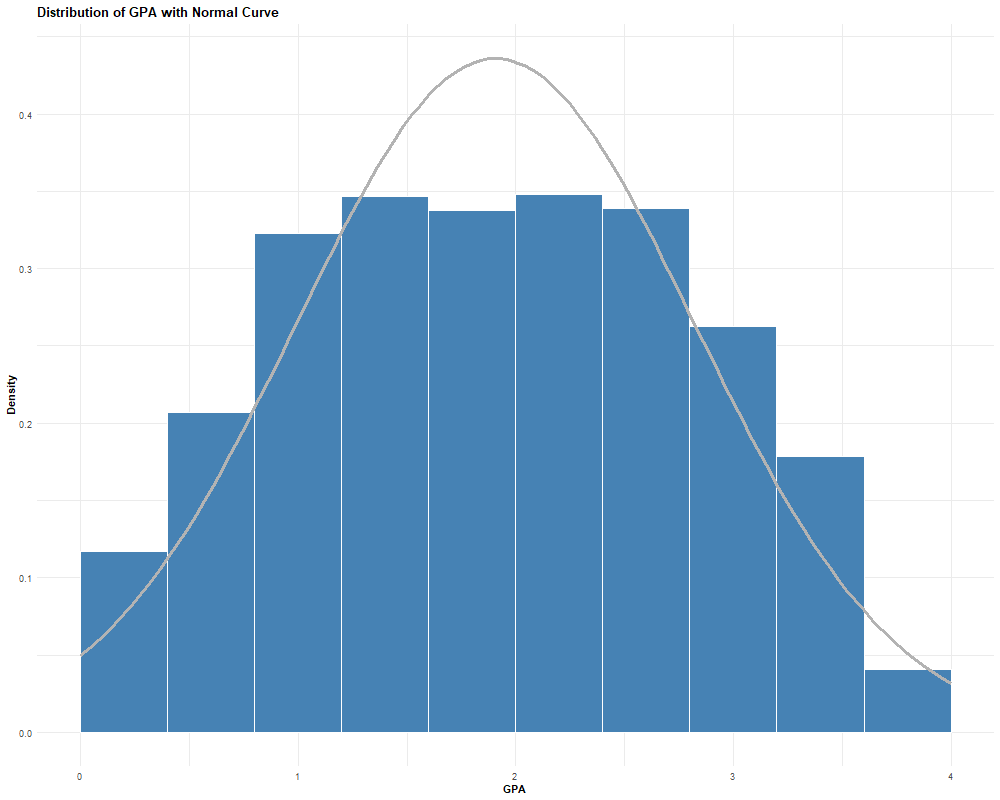
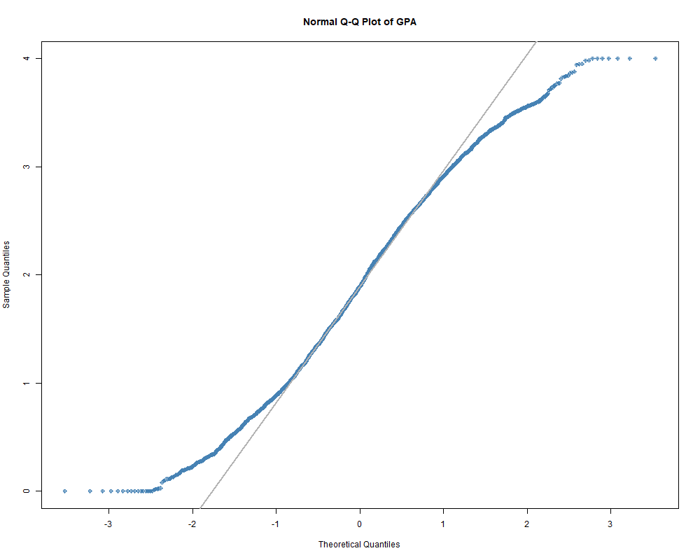

# Student Performance Statistical Analysis

An exploratory statistical analysis of a high school student performance dataset using **R** and **Quarto**.

This project applies descriptive statistics, exploratory data analysis (EDA), and introductory probability modelling to investigate patterns in academic performance across **2,392 students**. The analysis examines how demographic characteristics, study habits, and tutoring participation are associated with GPA and grade outcomes while demonstrating a reproducible statistical workflow in R.
---

## Project Overview

This project analyses a dataset containing **2,392 high school students** and **15 variables** covering:

- Demographic characteristics
- Study habits
- Parental involvement
- Extracurricular activities
- Academic performance

The project combines descriptive statistics, exploratory data analysis (EDA), statistical visualisation, and Normal distribution modelling to identify patterns in student academic performance and demonstrate a reproducible statistical analysis workflow.

---

## Objectives

The project was designed to:

- Understand the structure and measurement types of variables
- Explore the distribution of academic performance
- Summarise categorical and numerical variables using descriptive statistics
- Compare academic performance between tutoring groups
- Assess whether GPA can be reasonably approximated using a Normal distribution
- Compare theoretical probabilities with empirical observations

---

# Project Workflow

```
Dataset
      │
      ▼
Data Understanding
      │
      ▼
Descriptive Statistics
      │
      ▼
Exploratory Data Analysis
      │
      ▼
Relationship Analysis
      │
      ▼
Normal Distribution Assessment
      │
      ▼
Probability & Percentile Analysis
```

---

# Dataset

| Attribute | Value |
|-----------|-------|
| Observations | 2,392 students |
| Variables | 15 |

### Demographics

- Age
- Gender
- Ethnicity
- Parental Education

### Study Habits

- Weekly Study Time
- Absences
- Tutoring

### Parental Involvement

- Parental Support

### Extracurricular Activities

- Sports
- Music
- Volunteering
- Extracurricular Participation

### Academic Performance

- GPA
- Grade Class

> The dataset was provided for educational purposes.

---

# Analytical Methods

The project includes:

## Data Understanding

- Variable classification
- Measurement scales
- Research question development

---

## Descriptive Statistics

Categorical variables

- Frequency tables
- Percentage distributions
- Bar charts

Numerical variables

- Mean
- Median
- Standard deviation
- Interquartile range (IQR)
- Summary statistics
- Histograms
- Boxplots
- Outlier assessment using the 1.5 × IQR rule

---

## Relationship Analysis

Comparison of tutoring participation and academic performance using

- Contingency tables
- Conditional proportions
- Grouped bar charts
- Boxplots
- Summary statistics

---

## Normal Distribution

Assessment of GPA using

- Histogram with Normal density curve
- Normal Q-Q plot

---

## Probability Analysis

Comparison between

- Normal model probabilities
- Empirical probabilities

including

- Probability estimation
- Percentile estimation
- Top 10% GPA cutoff

---

# Key Findings

- GPA follows an approximately symmetric distribution with no extreme outliers under the 1.5 × IQR rule.
- Students who received tutoring generally exhibited slightly higher GPA values than those who did not receive tutoring.
- The GPA distribution was reasonably approximated by a Normal model, although slight deviations were observed in both tails.
- Theoretical probabilities from the Normal model were close to empirical probabilities observed in the dataset.

---

# Key Visualisations and Findings

## Distribution of Student GPA



The GPA distribution is approximately symmetric, with most students achieving GPAs between 1.0 and 3.0. The distribution shows no substantial skewness, suggesting that the mean provides a reasonable summary of central tendency and that GPA is suitable for further statistical modelling using a Normal approximation.

---

## Distribution and Spread of GPA



The boxplot indicates a moderate spread in GPA values and no observations were identified as outliers using the 1.5 × IQR rule. The median lies close to the centre of the box, providing further evidence that the GPA distribution is reasonably symmetric.

---

## Grade Distribution by Tutoring Participation



Students who received tutoring showed slightly higher proportions of A and B grades and a lower proportion of F grades than students who did not receive tutoring. Although the differences are modest, the distribution suggests a positive association between tutoring participation and academic performance.
---

## Comparison of GPA by Tutoring Status



Students who received tutoring achieved a higher median and mean GPA than those who did not receive tutoring, while both groups displayed similar variability. This suggests that tutoring is associated with slightly improved academic performance rather than substantial differences in GPA distribution.

---

## Normal Distribution Fit for GPA



The fitted Normal density closely follows the centre of the GPA distribution, indicating that a Normal model provides a reasonable approximation for the data. Minor deviations are visible near the lower and upper tails, suggesting the distribution is not perfectly Normal.

---

## Normal Q-Q Plot for GPA



Most observations follow the theoretical Normal reference line, supporting the assumption of approximate Normality. Small deviations at both tails indicate departures from a perfect Normal distribution, which is consistent with the histogram and Normal density assessment.

---

# Tools & Technologies

- R
- Quarto
- ggplot2
- Base R
- Git
- GitHub

---

# Skills Demonstrated

- Exploratory Data Analysis (EDA)
- Descriptive Statistics
- Data Visualisation
- Statistical Reporting
- Probability Modelling
- Normal Distribution Assessment
- Reproducible Research using Quarto
- Data Interpretation using R

---

# Repository Structure

```
student-performance-statistical-analysis/

│
├── images/
│   ├── histogram_gpa.png
│   ├── boxplot_gpa.png
│   ├── grade_distribution_by_tutoring.png
│   ├── gpa_by_tutoring.png
│   ├── gpa_normal_curve.png
│   └── qqplot_gpa.png
│
├── student_performance_analysis.qmd
├── student_performance_analysis.pdf
├── student_performance_data.csv
├── README.md
└── LICENSE
```

---

# Reproducibility

The complete analysis can be reproduced using:

- `student_performance_analysis.qmd`

The rendered report is available in:

- `student_performance_analysis.pdf`

---

# Future Improvements

Potential extensions of this project include:

- Investigating the relationship between weekly study time and GPA using correlation analysis.
- Applying statistical hypothesis testing to compare student groups.
- Developing regression models to identify factors associated with academic performance.
- Creating an interactive dashboard for exploratory analysis.
- Comparing multiple predictive models for GPA estimation.

---

## Project Outputs

This repository contains:

- A reproducible Quarto analysis (`student_performance_analysis.qmd`)
- A rendered statistical report (`student_performance_analysis.pdf`)
- The original dataset (`student_performance_data.csv`)
- Supporting visualisations used throughout the analysis
  
---

# License

This project is released under the MIT License.

---

# Author

**Viktor (Xuan Nam) Ngo**

Master of Data Science  
Adelaide University

GitHub: https://github.com/ViktorNgo3012
